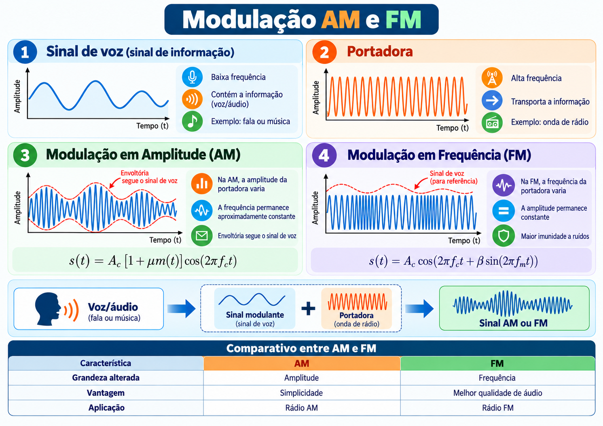

## Importância da Modulação nos Sistemas de Telecomunicações

A **modulação** é uma técnica fundamental nos sistemas de telecomunicações, pois permite transmitir informações, como voz, música e dados, por meio de ondas eletromagnéticas. Nesse processo, um sinal de informação modifica determinadas características de uma onda portadora de alta frequência, possibilitando sua transmissão por sistemas de comunicação.

A modulação contribui para a transmissão de sinais a longas distâncias, o uso eficiente do espectro de frequências e a redução de interferências entre diferentes canais de comunicação.

### Principais elementos utilizados

**a) Sinal de voz (sinal modulante):** representa a informação que será transmitida, como fala ou música. Normalmente, é convertido em um sinal elétrico por meio de um microfone.

**b) Onda portadora:** sinal de alta frequência utilizado para transportar a informação. Suas características, como amplitude ou frequência, são modificadas durante a modulação.

**c) Modulação em Amplitude (AM):** técnica na qual a amplitude da portadora varia conforme o sinal modulante, mantendo sua frequência constante. É utilizada principalmente em sistemas de radiodifusão AM.

**d) Modulação em Frequência (FM):** técnica na qual a frequência instantânea da portadora varia de acordo com o sinal modulante, mantendo sua amplitude constante. Apresenta maior resistência a ruídos de amplitude e é amplamente utilizada na radiodifusão FM.

### Aplicações práticas

- **Radiodifusão AM:** transmissão de programas de rádio, notícias e informações.
- **Radiodifusão FM:** transmissão de músicas, programas de rádio e conteúdos de áudio com maior fidelidade.
- **Comunicações aeronáuticas:** utilização de AM nas comunicações de voz entre pilotos e controladores de tráfego aéreo.
- **Radiocomunicação:** utilização de FM em diferentes sistemas de comunicação por rádio.
- **Televisão e comunicações digitais:** utilização de outras técnicas de modulação para transmitir áudio, vídeo e dados.

### Objetivo do estudo

Compreender a importância da modulação nos sistemas de telecomunicações, identificando as funções do sinal modulante e da onda portadora, além de analisar as diferenças entre as técnicas AM e FM e suas principais aplicações.

## Infográfico: Modulação AM e FM



### Descrição dos itens

**a) Sinal de voz**  
O sinal de voz é o **sinal de informação** ou **sinal modulante**. Ele possui baixa frequência em comparação com a portadora e carrega a mensagem que se deseja transmitir, como fala, música ou áudio em geral.

**b) Portadora**  
A portadora é uma onda senoidal de **alta frequência**, utilizada para transportar a informação a maiores distâncias. Sozinha, ela não contém a mensagem, mas serve como base para o processo de modulação.

**c) Modulação em Amplitude (AM)**  
Na modulação AM, a **amplitude da portadora varia** de acordo com o sinal de voz, enquanto a frequência permanece aproximadamente constante. A envoltória do sinal AM acompanha a forma do sinal modulante.

**d) Modulação em Frequência (FM)**  
Na modulação FM, a **frequência da portadora varia** de acordo com o sinal de voz, enquanto sua amplitude permanece praticamente constante. Esse tipo de modulação apresenta maior imunidade a ruídos e melhor qualidade de áudio.

### Resumo

O processo de modulação permite combinar o **sinal de voz** com uma **portadora**, gerando um sinal transmitido em **AM** ou **FM**. Em AM, varia-se a amplitude; em FM, varia-se a frequência.


# Simulação de Modulação AM e FM em Python

Este projeto apresenta uma simulação didática de **modulação em amplitude (AM)** e **modulação em frequência (FM)**. O programa gera um sinal senoidal de áudio, uma portadora e os respectivos sinais modulados, exibindo quatro gráficos para facilitar a comparação.

## Objetivo

Demonstrar como um sinal de informação pode alterar uma portadora em dois processos de modulação analógica:

- **AM:** a amplitude da portadora varia conforme o sinal de áudio.
- **FM:** a frequência instantânea da portadora varia conforme o sinal de áudio, enquanto sua amplitude permanece constante.

A simulação é útil para aulas introdutórias de Sistemas de Telecomunicações e Processamento de Sinais.

## Ambiente utilizado

A simulação foi desenvolvida e executada no **Google Colab**, ambiente gratuito de notebooks Python executados no navegador, sem necessidade de instalar o Python no computador.

**Acesso:** [Google Colab](https://colab.research.google.com/)

### Como executar no Google Colab

1. Acesse [https://colab.research.google.com/](https://colab.research.google.com/).
2. Clique em **Novo notebook**.
3. Copie o código apresentado na seção **Código da simulação** e cole em uma célula de código.
4. Execute a célula pelo botão de reprodução ou usando **Shift + Enter**.
5. Observe os quatro gráficos gerados diretamente abaixo da célula.
6. Para experimentar, altere `mu`, `beta`, `fm` ou `fc` e execute novamente.

O Google Colab normalmente já inclui as bibliotecas NumPy e Matplotlib, dispensando a instalação manual.

## Tecnologias e dependências

- [Google Colab](https://colab.research.google.com/): ambiente usado para executar a simulação.
- Python 3
- [NumPy](https://numpy.org/): operações numéricas e geração dos sinais.
- [Matplotlib](https://matplotlib.org/): visualização das formas de onda.

Se executar o código fora do Google Colab e as bibliotecas não estiverem instaladas, utilize:

```bash
pip install numpy matplotlib
```


## 1. Descrição do Code-01.py: Análise de Sinais

O código realiza a geração e representação gráfica de sinais senoidais, permitindo observar características como amplitude, frequência e período.

**Funcionalidades:**
- Geração de sinais senoidais.
- Representação dos sinais no domínio do tempo.
- Visualização da amplitude e da frequência.

**Bibliotecas utilizadas:** NumPy e Matplotlib.


Salve o exemplo abaixo como `modulacao_am_fm.py`:

```python
import numpy as np
import matplotlib.pyplot as plt

# Frequencia de amostragem
fs = 500_000

# Duracao da simulacao
duracao = 0.005

# Vetor de tempo
t = np.arange(0, duracao, 1/fs)

# Frequencia do audio
fm = 1000

# Frequencia da portadora
fc = 20000

# Amplitudes
Am = 1
Ac = 1

# Indice de modulacao AM
mu = 0.8

# Indice de modulacao FM
beta = 5

# Sinal de audio
audio = Am * np.sin(2 * np.pi * fm * t)

# Portadora
portadora = Ac * np.cos(2 * np.pi * fc * t)

# Modulacao AM
sinal_am = Ac * (1 + mu * audio) * \
           np.cos(2 * np.pi * fc * t)

# Modulacao FM
sinal_fm = Ac * np.cos(
    2 * np.pi * fc * t
    + beta * np.sin(2 * np.pi * fm * t)
)

# Graficos
plt.figure(figsize=(12, 10))

plt.subplot(4, 1, 1)
plt.plot(t * 1000, audio)
plt.title("1 - Sinal de Audio")
plt.ylabel("Amplitude")
plt.grid(True)

plt.subplot(4, 1, 2)
plt.plot(t * 1000, portadora)
plt.title("2 - Sinal da Portadora")
plt.ylabel("Amplitude")
plt.grid(True)

plt.subplot(4, 1, 3)
plt.plot(t * 1000, sinal_am)
plt.title("3 - Modulacao AM")
plt.ylabel("Amplitude")
plt.grid(True)

plt.subplot(4, 1, 4)
plt.plot(t * 1000, sinal_fm)
plt.title("4 - Modulacao FM")
plt.ylabel("Amplitude")
plt.xlabel("Tempo (ms)")
plt.grid(True)

plt.tight_layout()
plt.show()
```

## Parâmetros da simulação

| Parâmetro | Variável | Valor | Função |
|---|---|---:|---|
| Frequência de amostragem | `fs` | 500.000 Hz | Número de amostras por segundo |
| Duração | `duracao` | 0,005 s | Janela de 5 ms |
| Frequência do áudio | `fm` | 1.000 Hz | Frequência do sinal de informação |
| Frequência da portadora | `fc` | 20.000 Hz | Frequência central da portadora |
| Amplitude do áudio | `Am` | 1 | Amplitude do sinal modulante |
| Amplitude da portadora | `Ac` | 1 | Amplitude da portadora |
| Coeficiente AM | `mu` | 0,8 | Profundidade de modulação de 80% quando `Am = 1` |
| Índice FM | `beta` | 5 | Controla o desvio de frequência relativo ao áudio |

A frequência de amostragem de 500 kHz é suficientemente elevada para representar as oscilações simuladas. O vetor `t` define os instantes em que cada sinal é calculado.

## Fundamentação matemática

### 1. Sinal de áudio

O sinal modulante é uma senoide de 1 kHz:

$$
m(t)=A_m\sin(2\pi f_m t)
$$

No exemplo, $A_m=1$ e $f_m=1000\ \text{Hz}$. Trata-se de um sinal de teste, não de uma gravação real de voz ou música.

### 2. Portadora

A portadora é definida por:

$$
c(t)=A_c\cos(2\pi f_c t)
$$

Com $A_c=1$ e $f_c=20000\ \text{Hz}$, ela possui frequência superior à do sinal modulante.

### 3. Modulação AM

Na modulação em amplitude, a envoltória da portadora acompanha o sinal de informação:

$$
s_{AM}(t)=A_c[1+\mu m(t)]\cos(2\pi f_c t)
$$

Para $A_m=1$ e $\mu=0{,}8$, a envoltória varia entre **0,2 e 1,8** em amplitude normalizada. A frequência da portadora permanece em 20 kHz.

> **Observação:** como o código usa `audio = Am * sin(...)`, a profundidade efetiva da modulação AM é `mu * Am`. O valor de 80% pressupõe `Am = 1`.

### 4. Modulação FM

Na modulação em frequência, a amplitude é constante e a frequência instantânea muda conforme o sinal modulante:

$$
s_{FM}(t)=A_c\cos\left[2\pi f_c t+\beta\sin(2\pi f_m t)\right]
$$

O desvio máximo de frequência é:

$$
\Delta f=\beta f_m=5\cdot1000=5000\ \text{Hz}
$$

Assim, a frequência instantânea oscila entre **15 kHz e 25 kHz**. Visualmente, os ciclos da onda ficam mais próximos ou mais afastados, sem alteração da amplitude.

> **Observação:** na expressão FM implementada, `Am` não é usado diretamente. A influência do sinal de informação já está representada pelo índice `beta`.

## Interpretação dos gráficos

O programa gera quatro gráficos empilhados verticalmente:

1. **Sinal de áudio:** senoide de 1 kHz, que representa a informação.
2. **Sinal da portadora:** senoide de 20 kHz, antes da modulação.
3. **Modulação AM:** sinal de alta frequência com envoltória variável conforme o áudio.
4. **Modulação FM:** sinal de amplitude constante, mas com variações no espaçamento entre as oscilações.

O eixo horizontal está em **milissegundos (ms)** e o vertical indica a **amplitude**. A figura cobre 5 ms da simulação.

## Comparação entre AM e FM

| Característica | AM | FM |
|---|---|---|
| Parâmetro modificado | Amplitude | Frequência instantânea |
| Amplitude do sinal modulado | Variável | Constante |
| Frequência central | 20 kHz | 20 kHz |
| Parâmetro da modulação | `mu = 0.8` | `beta = 5` |
| Efeito visual | Envoltória acompanha o áudio | Ciclos ficam mais próximos ou afastados |

## Execução local (alternativa ao Google Colab)

1. Salve o código como `modulacao_am_fm.py`.
2. Instale as dependências com `pip install numpy matplotlib`.
3. Execute no terminal:

   ```bash
   python modulacao_am_fm.py
   ```

4. Observe a janela com os quatro gráficos. Para executar no Google Colab, siga as instruções da seção **Ambiente utilizado**.

## Experimentos sugeridos

- **Alterar a profundidade AM:** teste `mu = 0.3`, `mu = 0.8` e `mu = 1.2`. O último caso produz sobremodulação no modelo adotado.
- **Alterar a modulação FM:** teste `beta = 1`, `beta = 5` e `beta = 10` para comparar o desvio de frequência.
- **Modificar as frequências:** altere `fm` e `fc` e observe a quantidade de ciclos exibidos.
- **Aumentar a duração:** experimente `duracao = 0.01` para visualizar 10 ms.

## Limitações

O exemplo mostra somente a **geração e a visualização dos sinais modulados**. Não realiza transmissão física, introdução de ruído, filtragem ou demodulação. O sinal de áudio é uma senoide idealizada.

## Aplicação didática

A atividade permite relacionar a formulação matemática à forma de onda observada no tempo, comparar AM e FM e investigar como a escolha dos parâmetros interfere no comportamento da portadora.


## 2. Descrição do Code-02.py: Modulação em Amplitude (AM)

O código realiza uma simulação da modulação em amplitude (AM), utilizando um sinal modulante de 100 Hz e uma onda portadora de 2 kHz.

A modulação utiliza um índice de 80%, permitindo observar a variação da amplitude da portadora conforme o sinal de informação.

**Funcionalidades:**
- Geração do sinal modulante.
- Geração da onda portadora.
- Simulação do sinal modulado em AM.
- Representação gráfica das envoltórias do sinal AM.

**Bibliotecas utilizadas:** NumPy e Matplotlib.


## Análise de Sinais nos Domínios do Tempo e da Frequência (FFT)

### Descrição

Este código em Python permite gerar e analisar um sinal senoidal nos domínios do tempo e da frequência, utilizando as bibliotecas **NumPy** e **Matplotlib**. A simulação foi desenvolvida para execução no [Google Colab](https://colab.research.google.com/), sem necessidade de instalação local.

O programa gera um sinal senoidal com amplitude de 2 unidades e frequência de 10 Hz, utilizando uma frequência de amostragem de 1000 Hz e duração de 1 segundo.

Inicialmente, o sinal é representado graficamente no domínio do tempo, permitindo observar suas oscilações, amplitude e período. Em seguida, aplica-se a **Transformada Rápida de Fourier (FFT)** para obter o espectro de frequência e identificar a componente predominante do sinal.

### Parâmetros da Simulação

| Parâmetro | Valor |
|---|---|
| Amplitude do sinal | 2 |
| Frequência do sinal | 10 Hz |
| Frequência de amostragem | 1000 Hz |
| Duração da simulação | 1 segundo |
| Ferramentas | Python, NumPy e Matplotlib |
| Ambiente de execução | Google Colab |

### Representação Matemática

O sinal senoidal é descrito pela equação:

\[
s(t) = 2\sin(2\pi 10t)
\]

A aplicação da FFT permite identificar a frequência predominante e estimar sua amplitude.

### Resultados Esperados

O programa gera dois gráficos:

1. **Domínio do tempo:** apresenta a forma de onda senoidal e suas oscilações ao longo do tempo.
2. **Domínio da frequência:** apresenta o espectro de amplitude, destacando um pico em 10 Hz.

Ao final, o programa identifica automaticamente os valores esperados:

- **Amplitude:** 2,0
- **Frequência:** 10,0 Hz

### Aplicação Didática

A simulação permite compreender a relação entre os domínios do tempo e da frequência, demonstrando como a FFT pode identificar componentes espectrais de um sinal.

O experimento complementa o estudo das modulações AM e FM, fornecendo uma base para analisar as frequências presentes em sinais modulados e suas respectivas bandas laterais.

**Ambiente utilizado:** [Google Colab](https://colab.research.google.com/)


## 3. Descrição do Code-03.py: Modulação em Frequência (FM)

O código realiza a simulação da modulação em frequência (FM), demonstrando como a frequência instantânea da portadora varia de acordo com o sinal modulante, mantendo sua amplitude constante.

**Funcionalidades:**
- Geração do sinal de informação.
- Geração da onda portadora.
- Simulação da modulação FM.
- Visualização gráfica do sinal modulado.

**Bibliotecas utilizadas:** NumPy e Matplotlib.

## Objetivo do Repositório

Disponibilizar exemplos práticos em Python para auxiliar no ensino e na compreensão dos conceitos fundamentais de sinais e sistemas de telecomunicações.
 

## Simulação de Modulação em Amplitude (AM) com Python

### Descrição

Este projeto apresenta uma simulação da **Modulação em Amplitude (AM)** utilizando a linguagem Python e as bibliotecas **NumPy** e **Matplotlib**.

O código gera um sinal de informação (modulante) com frequência de **100 Hz** e uma onda portadora de **2 kHz**. Em seguida, realiza a modulação AM com índice de modulação de **80%**, permitindo observar como a amplitude da portadora varia de acordo com o sinal de informação, mantendo sua frequência constante.

### Parâmetros da simulação

| Parâmetro | Valor |
|---|---|
| Frequência do sinal modulante | 100 Hz |
| Frequência da portadora | 2 kHz |
| Amplitude do sinal modulante | 1 |
| Amplitude da portadora | 1 |
| Índice de modulação | 80% |
| Frequência de amostragem | 100 kHz |
| Duração da simulação | 30 ms |

### Representação gráfica

O programa apresenta três gráficos:

1. **Sinal modulante:** representa a informação original, com frequência de 100 Hz.
2. **Sinal da portadora:** apresenta uma onda senoidal de 2 kHz, responsável pelo transporte da informação.
3. **Sinal modulado em AM:** demonstra a variação da amplitude da portadora e suas envoltórias superior e inferior, que acompanham o sinal modulante.

### Bibliotecas utilizadas

- **NumPy:** geração dos sinais senoidais e realização dos cálculos matemáticos.
- **Matplotlib:** construção e visualização dos gráficos dos sinais.

### Objetivo

Demonstrar, de forma didática, o funcionamento da modulação em amplitude (AM), permitindo compreender a relação entre o sinal modulante, a onda portadora e o sinal modulado.

A simulação também possibilita analisar a influência do índice de modulação sobre a amplitude do sinal transmitido, contribuindo para o estudo dos princípios fundamentais dos sistemas de telecomunicações.

**Ambiente utilizado:** [Google Colab](https://colab.research.google.com/)

## 4. Descrição do Code04frequencias.py: 

### Simulação de Sinais Senoidais em Diferentes Frequências

### Descrição

Este código em Python realiza a **geração e representação gráfica de sinais senoidais em diferentes frequências**, utilizando as bibliotecas **NumPy** e **Matplotlib**.

O programa simula sinais com frequências de **10 Hz, 100 Hz, 1 kHz, 10 kHz, 10 MHz e 100 MHz**, mantendo a amplitude constante em 1.

Para cada frequência, são apresentados três períodos completos do sinal, permitindo observar a relação entre frequência, período e comportamento da onda no domínio do tempo.

### Gráficos gerados

O programa gera **6 gráficos individuais**, correspondentes às seguintes frequências:

1. **10 Hz:** sinal senoidal de baixa frequência.
2. **100 Hz:** sinal com frequência dez vezes maior que o anterior.
3. **1 kHz:** sinal senoidal com frequência de 1.000 Hz.
4. **10 kHz:** sinal com frequência de 10.000 Hz.
5. **10 MHz:** sinal de alta frequência, com 10 milhões de ciclos por segundo.
6. **100 MHz:** sinal de radiofrequência, com 100 milhões de ciclos por segundo.

Cada gráfico apresenta três períodos completos, com o eixo horizontal representando o tempo em segundos e o eixo vertical indicando a amplitude do sinal.

### Principais funcionalidades

- Geração de sinais senoidais com diferentes frequências.
- Cálculo automático do período de cada sinal.
- Representação gráfica de três períodos completos.
- Visualização da relação entre frequência e período.
- Exibição dos valores de frequência e período no terminal.

### Bibliotecas utilizadas

- **NumPy:** cálculos matemáticos e geração dos sinais senoidais.
- **Matplotlib:** construção e apresentação dos gráficos.

### Objetivo

Demonstrar, de forma didática, o comportamento de sinais senoidais em diferentes faixas de frequência, evidenciando que o aumento da frequência provoca a redução do período do sinal.

A simulação contribui para o estudo dos fundamentos de sinais e sistemas, eletrônica e telecomunicações.


## 5. Descrição do Code04bfrequencias.py


## Simulação de Sinais Senoidais Sobrepostos em Diferentes Frequências

### Descrição

O código em Python realiza a **geração e representação gráfica de quatro sinais senoidais com diferentes frequências**, utilizando as bibliotecas **NumPy** e **Matplotlib**.

A simulação apresenta sinais de **10 Hz, 100 Hz, 1 kHz e 10 kHz**, todos com amplitude constante igual a 1, sobrepostos em um único gráfico. A janela de tempo utilizada é de **0,1 segundo (100 ms)**, permitindo comparar o comportamento das ondas no domínio do tempo.

### Principais funcionalidades

- Geração de quatro sinais senoidais.
- Representação dos sinais sobrepostos em um único gráfico.
- Identificação das frequências por cores e legendas.
- Comparação entre frequência, período e quantidade de oscilações.
- Visualização do comportamento de sinais de diferentes frequências.

### Bibliotecas utilizadas

- **NumPy:** geração dos sinais senoidais e cálculos matemáticos.
- **Matplotlib:** construção e visualização do gráfico.

### Objetivo

Demonstrar visualmente a relação entre frequência e período dos sinais senoidais, evidenciando que frequências maiores apresentam períodos menores e maior quantidade de oscilações em um mesmo intervalo de tempo. A simulação contribui para o estudo dos fundamentos de sinais e sistemas de telecomunicações.


### Atividade Prática: Alteração dos Parâmetros da Simulação

Os alunos deverão modificar os parâmetros de **frequência dos sinais** e **janela de tempo** diretamente no código Python, executando novas simulações para observar as alterações nos gráficos.

**a. Alteração das frequências**

Modificar os valores da lista `frequencias`, mantendo os nomes correspondentes na lista `nomes`.

```python
frequencias = [10, 100, 1000, 10000]
nomes = ["10 Hz", "100 Hz", "1000 Hz", "10000 Hz"]
```

**b. Alteração da janela de tempo**

Modificar o intervalo de tempo utilizado na geração dos sinais.

```python
t = np.linspace(0, 0.1, 5000)
```

O valor `0.1` representa a duração de 0,1 segundo, enquanto `5000` corresponde à quantidade de pontos utilizados na simulação.

**c. Análise dos resultados**

Após executar as simulações, os alunos deverão observar:

- Como o aumento da frequência modifica o número de oscilações.
- Como a redução da frequência aumenta o período do sinal.
- Como a alteração da janela de tempo influencia a visualização das ondas.
- Como a quantidade de amostras interfere na representação gráfica dos sinais.

**Objetivo da atividade:** compreender experimentalmente a relação entre frequência, período e tempo, utilizando simulações computacionais em Python aplicadas ao estudo de sinais e sistemas de telecomunicações.

